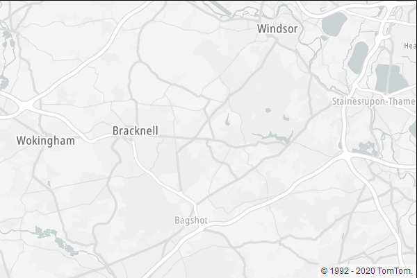
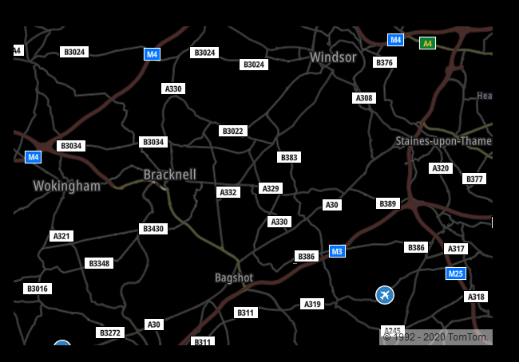
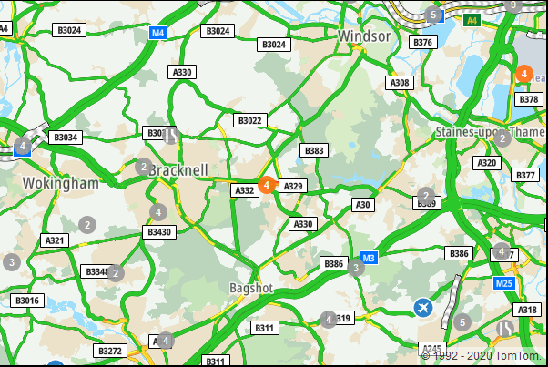
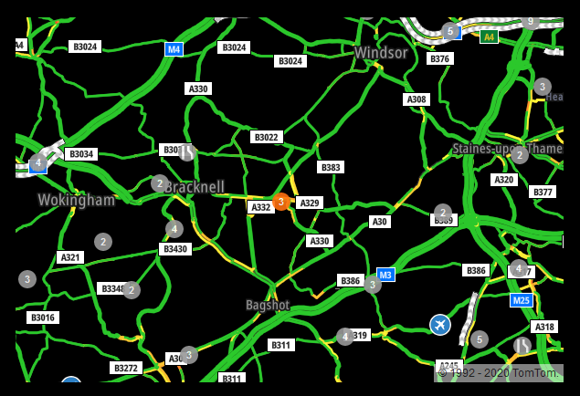
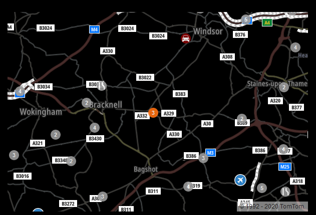

# MMM-TomTomTrafficMaps

Forked from tomtomtrafficincidents (https://github.com/Travelbacon/MMM-TomTomTrafficIncidents), merging all the current (march 2020) tomtom traffic information APIs into one module and simplyfing the map handling 

Thanks to https://github.com/Travelbacon for creating the original module which forms part of this revised module

This Magic Mirror Module shows a map, additionally with traffic and incidents information from TomTom. You can select how the traffic will be displayed: a road with slow speed can be marked red, or only when there is a congestion? It can also show traffic incidents as icons, accidents, road blocks, etc..
The Big difference with Google and Bing Maps is that it is free for up to 2,500 daily requests, no money will be charged when you go above this limit but you will be warned. 
The module uses the public V5 version of the TOMTOM APIs.

Example maps:<br><br>






# Configuring the Module
To use this module, add the following configuration to your `config/config.js` file. In this examle I've chosen Vancouver BC.
````javascript
	modules: [
		{	
		module: "MMM-TomTomTrafficMaps",
		position: "top_center",
		config: {
			key: "yourkey",
			lng: -123.1139529,
			lat:  49.2608724,
			zoom: 11,
			height: "500px",
			width: "800px"
		}
	]
````
The following settings can be changed.

## Required settings.
### key from TomTom
- `key`: default `""`
In order to get the data from TomTom, a developers key is required. A key can be obtained free, and without the need of a credit card, from the developers site. At [developer.tomtom.com](https://developer.tomtom.com) you can register yourself. When your registration is a success, the site will guide you to create a key for you application.
The key is free for 2.500 transactions on daily basis. When this limit has been reached, an error "HTTP 403 – Over the limit error" will be given. See refresh in Optional Settings for more information.

- `lng`: longitude default none.
- `lat`: latitude default none.
Select your longitude and latitude. You can obtain from [maps.ie](https://www.maps.ie/coordinates.html) the longitude and latitude for places. Or use Google Maps to get the longitude and latitude of your desired location. You can find them after the @ sign in the address bar. If you keep lng and lat settings empty, TomTom will go to longitude 0 and latitude 0. [That](https://mydrive.tomtom.com/en_us/#mode=search+viewport=0,0,5,0,-0+ver=3) is somewhere under Ghana in the Atlantic Ocean/Gulf of Guinea.

## Optional settings you want to change
- `height`: height in CSS unit. Default `"75vh"`.
- `width`: width in CSS unit. Default `"75vw"`.
Here you can set the height and width of the map in any [CSS unit style](https://developer.mozilla.org/en-US/docs/Learn/CSS/Building_blocks/Values_and_units). Try, and see what size suits the best for you.

- `zoom` : zoom level of the map. Default `11`.
Zoom level can be between 0 - 24

- `lang` : language specified in config.js under language.

## Optional Settings you might want to change to make the display best for your MM2
- `Map-style`: Default `"basic-main"`
  Full details of the different mapstyles, traffic flow styles and incident styles are available on the TOMTOM developers site

  Available (mar 2020):
  		`"basic-main"`
		`"basic-night"`
		`"hybrid-main"`
		`"hybrid-night"`
		`"labels-main"`
		`"labels-night"`
		`"basic-light"`

- `trafficStyle`: Default `"relative"`

	`absolute`: This reflects the absolute speed.<br>
	`relative`: This is the speed relative to free-flow, highlighting areas of congestion.<br>
	`relative-delay`:The relative speed values are different from the ones for the free-flow. This only highlights areas of congestion.<br>

- `incidentStyle`:  Default `"s1"`

	`s0`
	`s0-dark`
	`s1`
	`s2`
	`s3`
	`night`

- `refresh`: integer that is the amount of ms for a refresh of traffic and incident information. Default `(15 * 60 * 1000)`. Equals 15 minuts.
On TomTom you get 2.5000 transactions on daily basis for free. When you reach the limit, "HTTP 403 – Over the limit error" errors will be shown in the log of MagicMirror.
The calculation of the amount of request is hard to guess. It depends on the amount of accidents and traffic. But 2.500 requests is hard to reach. 15 incidents count as one requests.

- `showIncidents`:  `true`/`false` default is `true`
Shows incidents like road blocks, incidents, narrowing, road construction etc. etc. on the map.
- `showTraffic`: `true`/`false` default is `true`
If you want to display traffic.

## Optional Settings you shouldn't care about

- `TTVersion`: version in string default is `"5.47.0"`
Whenever TomTom releases a new version, this value can be changed to the most current version.
